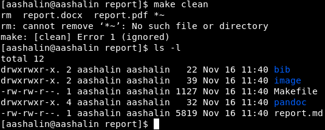

---
## Front matter
title: "Отчёт по лабораторной работе №3"
subtitle: "Дисциплина: Архитектура компьютера"
author: "Арсений Андреевич Шалин"

## Generic otions
lang: ru-RU
toc-title: "Содержание"

## Bibliography
bibliography: bib/cite.bib
csl: pandoc/csl/gost-r-7-0-5-2008-numeric.csl

## Pdf output format
toc: true # Table of contents
toc-depth: 2
lof: true # List of figures
lot: true # List of tables
fontsize: 12pt
linestretch: 1.5
papersize: a4
documentclass: scrreprt
## I18n polyglossia
polyglossia-lang:
  name: russian
  options:
	- spelling=modern
	- babelshorthands=true
polyglossia-otherlangs:
  name: english
## I18n babel
babel-lang: russian
babel-otherlangs: english
## Fonts
mainfont: IBM Plex Serif
romanfont: IBM Plex Serif
sansfont: IBM Plex Sans
monofont: IBM Plex Mono
mathfont: STIX Two Math
mainfontoptions: Ligatures=Common,Ligatures=TeX,Scale=0.94
romanfontoptions: Ligatures=Common,Ligatures=TeX,Scale=0.94
sansfontoptions: Ligatures=Common,Ligatures=TeX,Scale=MatchLowercase,Scale=0.94
monofontoptions: Scale=MatchLowercase,Scale=0.94,FakeStretch=0.9
mathfontoptions:
## Biblatex
biblatex: true
biblio-style: "gost-numeric"
biblatexoptions:
  - parentracker=true
  - backend=biber
  - hyperref=auto
  - language=auto
  - autolang=other*
  - citestyle=gost-numeric
## Pandoc-crossref LaTeX customization
figureTitle: "Рис."
tableTitle: "Таблица"
listingTitle: "Листинг"
lofTitle: "Список иллюстраций"
lotTitle: "Список таблиц"
lolTitle: "Листинги"
## Misc options
indent: true
header-includes:
  - \usepackage{indentfirst}
  - \usepackage{float} # keep figures where there are in the text
  - \floatplacement{figure}{H} # keep figures where there are in the text
---

# Цель работы

Целью работы является освоение процедуры оформления отчетов с помощью легковесного языка разметки Markdown.

# Выполнение лабораторной работы

Открыл терминал, перешёл в рабочий каталог, скачал изменения из репозитория.  (рис. [-@fig:001]).

{#fig:001 width=70%}

Перешёл в каталог для отчёта №3. (рис. [-@fig:002]).

{#fig:002 width=70%}

Провёл компиляцию report.md с помощью Makefile. (рис. [-@fig:003]).

{#fig:003 width=70%}

Удалил сгенерированные файлы используя Makefile. (рис. [-@fig:004]).

{#fig:004 width=70%}

Открыл шаблон отчёта с помощью gedit. (рис. [-@fig:005]).

{#fig:005 width=70%}

Заполнил шаблон отчёта report.md.
Сгенерировал отчёт и загрузил его в репозиторий.

# Выполнение cамостоятельной работы

* Перешёл в каталог лабораторной №2.
* Скопировал заполненный report.md из каталога лабораторной №3.
* Скопировал изображения и текст из отчёта №2, сделанного не в Markdown.
* Сгенерировал отчёт и загрузил его в репозиторий.

Ссылка на отчёт лабораторной №2, сделанный в Markdown. <https://github.com/arsenyshalin/study_2024-2025_arh-pc/tree/master/labs/lab02/report>

# Выводы

Было изучено оформление отчётов с помощью Markdown и программ TexLive и Pandoc.
Подготовлены отчёты в разметке Markdown лабораторных работ №2 и №3.
Отчёты сгенерированы в форматах .pdf и .docx, загружены в репозиторий.

Ссылка на отчёт лабораторной №3, сделанный в Markdown. <https://github.com/arsenyshalin/study_2024-2025_arh-pc/tree/master/labs/lab03/report>

# Список литературы{.unnumbered}

::: {#refs}
:::
