---
## Front matter
title: "Отчёт по лабораторной работе №4"
subtitle: "Дисциплина: Архитектура компьютера"
author: "Арсений Андреевич Шалин"

## Generic otions
lang: ru-RU
toc-title: "Содержание"

## Bibliography
bibliography: bib/cite.bib
csl: pandoc/csl/gost-r-7-0-5-2008-numeric.csl

## Pdf output format
toc: true # Table of contents
toc-depth: 2
lof: true # List of figures
lot: true # List of tables
fontsize: 12pt
linestretch: 1.5
papersize: a4
documentclass: scrreprt
## I18n polyglossia
polyglossia-lang:
  name: russian
  options:
	- spelling=modern
	- babelshorthands=true
polyglossia-otherlangs:
  name: english
## I18n babel
babel-lang: russian
babel-otherlangs: english
## Fonts
mainfont: IBM Plex Serif
romanfont: IBM Plex Serif
sansfont: IBM Plex Sans
monofont: IBM Plex Mono
mathfont: STIX Two Math
mainfontoptions: Ligatures=Common,Ligatures=TeX,Scale=0.94
romanfontoptions: Ligatures=Common,Ligatures=TeX,Scale=0.94
sansfontoptions: Ligatures=Common,Ligatures=TeX,Scale=MatchLowercase,Scale=0.94
monofontoptions: Scale=MatchLowercase,Scale=0.94,FakeStretch=0.9
mathfontoptions:
## Biblatex
biblatex: true
biblio-style: "gost-numeric"
biblatexoptions:
  - parentracker=true
  - backend=biber
  - hyperref=auto
  - language=auto
  - autolang=other*
  - citestyle=gost-numeric
## Pandoc-crossref LaTeX customization
figureTitle: "Рис."
tableTitle: "Таблица"
listingTitle: "Листинг"
lofTitle: "Список иллюстраций"
lotTitle: "Список таблиц"
lolTitle: "Листинги"
## Misc options
indent: true
header-includes:
  - \usepackage{indentfirst}
  - \usepackage{float} # keep figures where there are in the text
  - \floatplacement{figure}{H} # keep figures where there are in the text
---

# Цель работы

Освоение процедуры компиляции и сборки программ, написанных на ассемблере NASM.

# Выполнение лабораторной работы

Создал текстовый файл hello.asm и ввёл комманду открытия в gedit  (рис. [-@fig:001]).

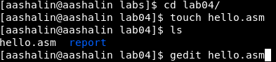{#fig:001 width=70%}

Ввёл в hello.asm необходимую программу (рис. [-@fig:002]).

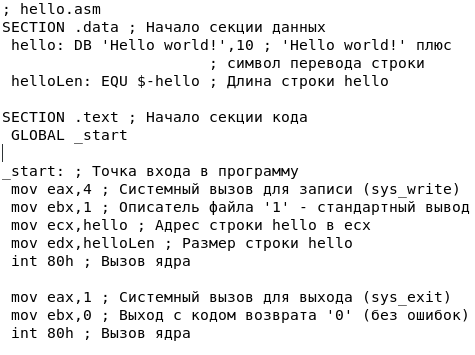{#fig:002 width=70%}

Провёл трансляцию hello.asm в объектный файл (рис. [-@fig:003]).

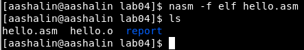{#fig:003 width=70%}

Скомпилировал hello.asm в obj.o с отладочной информацией и файлом листинга (рис. [-@fig:004]).

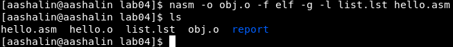{#fig:004 width=70%}

Скомпоновал объектный файл в исполняемый (рис. [-@fig:005]).

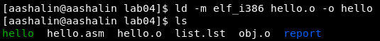{#fig:005 width=70%}

Скомпоновал объектный файл obj.o в исполняемый файл main (рис. [-@fig:006]).

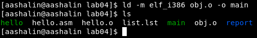{#fig:006 width=70%}

Запустил исполняемый файл hello (рис. [-@fig:007]).

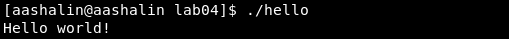{#fig:007 width=70%}

# Выполнение cамостоятельной работы

Создал копию hello.asm с именем lab4.asm (рис. [-@fig:008]).

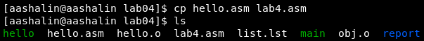{#fig:008 width=70%}

С помощью gedit открыл lab4.asm и ввёл своё имя вместо сообщения "Hello world" (рис. [-@fig:009]).

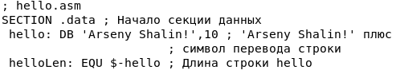{#fig:009 width=70%}

Оттранслировал lab4.asm в объектный файл (рис. [-@fig:010]).

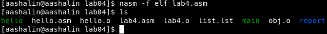{#fig:010 width=70%}

Выполнил компоновку объектного файла и запустил его (рис. [-@fig:011]).

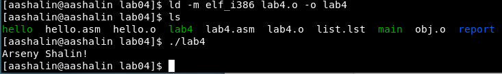{#fig:011 width=70%}

Ссылка на отчёт лабораторной №4, сделанный в Markdown. <https://github.com/arsenyshalin/study_2024-2025_arh-pc/tree/master/labs/lab04/report>

``` asm
; hello.asm
SECTION .data ; Начало секции данных
 hello: DB 'Arseny Shalin!',10 ; 'Arseny Shalin!' плюс
                       ; символ перевода строки
 helloLen: EQU $-hello ; Длина строки hello

SECTION .text ; Начало секции кода
 GLOBAL _start

_start: ; Точка входа в программу
 mov eax,4 ; Системный вызов для записи (sys_write)
 mov ebx,1 ; Описатель файла '1' - стандартный вывод
 mov ecx,hello ; Адрес строки hello в ecx
 mov edx,helloLen ; Размер строки hello
 int 80h ; Вызов ядра

 mov eax,1 ; Системный вызов для выхода (sys_exit)
 mov ebx,0 ; Выход с кодом возврата '0' (без ошибок)
 int 80h ; Вызов ядра
```

# Выводы

Освоена процедура компиляции и компоновки программы на ассемблере.

# Список литературы{.unnumbered}

::: {#refs}
:::
