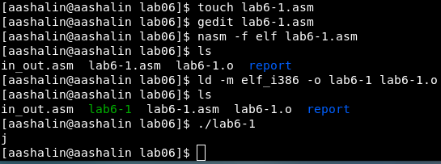
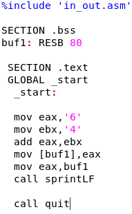
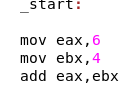
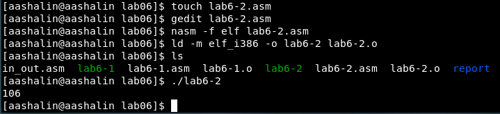
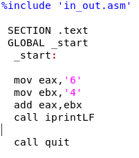
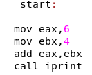
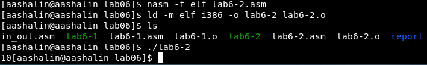
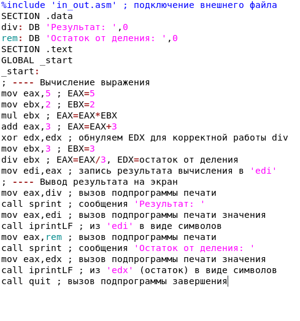
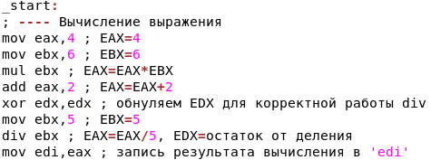
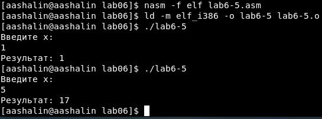

---
## Front matter
title: "Отчёт по лабораторной работе №6"
subtitle: "Дисциплина: Архитектура компьютера"
author: "Арсений Андреевич Шалин"

## Generic otions
lang: ru-RU
toc-title: "Содержание"

## Bibliography
bibliography: bib/cite.bib
csl: pandoc/csl/gost-r-7-0-5-2008-numeric.csl

## Pdf output format
toc: true # Table of contents
toc-depth: 2
lof: true # List of figures
lot: true # List of tables
fontsize: 12pt
linestretch: 1.5
papersize: a4
documentclass: scrreprt
## I18n polyglossia
polyglossia-lang:
  name: russian
  options:
	- spelling=modern
	- babelshorthands=true
polyglossia-otherlangs:
  name: english
## I18n babel
babel-lang: russian
babel-otherlangs: english
## Fonts
mainfont: IBM Plex Serif
romanfont: IBM Plex Serif
sansfont: IBM Plex Sans
monofont: IBM Plex Mono
mathfont: STIX Two Math
mainfontoptions: Ligatures=Common,Ligatures=TeX,Scale=0.94
romanfontoptions: Ligatures=Common,Ligatures=TeX,Scale=0.94
sansfontoptions: Ligatures=Common,Ligatures=TeX,Scale=MatchLowercase,Scale=0.94
monofontoptions: Scale=MatchLowercase,Scale=0.94,FakeStretch=0.9
mathfontoptions:
## Biblatex
biblatex: true
biblio-style: "gost-numeric"
biblatexoptions:
  - parentracker=true
  - backend=biber
  - hyperref=auto
  - language=auto
  - autolang=other*
  - citestyle=gost-numeric
## Pandoc-crossref LaTeX customization
figureTitle: "Рис."
tableTitle: "Таблица"
listingTitle: "Листинг"
lofTitle: "Список иллюстраций"
lotTitle: "Список таблиц"
lolTitle: "Листинги"
## Misc options
indent: true
header-includes:
  - \usepackage{indentfirst}
  - \usepackage{float} # keep figures where there are in the text
  - \floatplacement{figure}{H} # keep figures where there are in the text
---

# Цель работы

Освоение арифметических инструкций языка ассемблера NASM.

# Выполнение лабораторной работы

Создал текстовый файл lab6-1.asm и ввёл программу из листинга 6.1, скомпилировал, скомпоновал в исполняемый файл lab6-1, запустил (рис. [-@fig:001], [-@fig:002]).

{#fig:001 width=70%}

{#fig:002 width=30%}

Удалил в текстовом файле lab6-1.asm кавычки у чисел (рис. [-@fig:003]).

{#fig:003 width=30%}

Создал исполняемый файл и запустил его (рис. [-@fig:004]).

{#fig:004 width=70%}

Создал текстовый файл lab6-2.asm и ввёл программу из листинга 6.2, создал исполняемый файл lab6-2, запустил (рис. [-@fig:005], [-@fig:006]).

{#fig:005 width=70%}

{#fig:006 width=30%}

Удалил в текстовом файле lab6-2.asm кавычки у чисел (рис. [-@fig:007]).

{#fig:007 width=30%}

Создал исполняемый файл и запустил его (рис. [-@fig:008]).

{#fig:008 width=70%}

Заменил функцию iprintLF на iprint (рис. [-@fig:009]).

{#fig:009 width=30%}

Создал исполняемый файл и запустил его (рис. [-@fig:010]).

{#fig:010 width=70%}

Создал текстовый файл lab6-3.asm и ввёл программу из листинга 6.3 (рис. [-@fig:011]).

{#fig:011 width=70%}

Создал исполняемый файл и запустил его (рис. [-@fig:012]).

{#fig:012 width=70%}

Изменил числа в программе на соответствующие для вычисления выражения $f (x) = (4 * 6 + 2)/5$ (рис. [-@fig:013]).

{#fig:013 width=70%}

Создал исполняемый файл и запустил его (рис. [-@fig:014]).

{#fig:014 width=70%}

Создал текстовый файл variant.asm и ввёл программу из листинга 6.4 (рис. [-@fig:015]).

{#fig:015 width=70%}

Создал исполняемый файл и запустил его, вычислил номер варианта для самостоятельной работы с помощью номера студенческого билета (рис. [-@fig:016]).

{#fig:016 width=70%}

Ответы на вопросы по листингу 6.4:

1. ``` asm
mov eax,rem
call sprint
```
1. Для чтения числа с клавиатуры.
1. Для вызова подпрограммы, преобразующей код ASCII в число.
1. ``` asm
xor edx,edx
mov ebx,20
div ebx
inc edx
```
1. В edx.
1. Для увеличения остатка от деления на 1.
1. ``` asm
mov eax,edx
call iprintLF
```

# Выполнение cамостоятельной работы

Создаю программу для вычисления ответов на выражение $(8x − 6)/2$.

``` asm
%include 'in_out.asm'

; вариант 12: (8x-6)/2

SECTION .data
 msg: DB 'Введите x: ',0
 rem: DB 'Результат: ',0

SECTION .bss
 x: RESB 80

SECTION .text
 GLOBAL _start
 _start:

  mov eax, msg
  call sprintLF

  mov ecx, x
  mov edx, 80
  call sread

  mov eax,x ; вызов подпрограммы преобразования
  call atoi ; ASCII кода в число, `eax=x`
  xor edx,edx
  mov ebx,8
  mul ebx
  sub eax,6

  mov edi,2
  div edi
  mov edi,eax

  mov eax,rem
  call sprint

  mov eax,edi
  call iprintLF

  call quit
```

После написания программы для вычисления ответа на вариант 12 в текстовом файле lab6-5.asm создал исполняемый файл lab6-5 (рис. [-@fig:017]).

{#fig:017 width=70%}


Ссылка на отчёт лабораторной №6, сделанный в Markdown. <https://github.com/arsenyshalin/study_2024-2025_arh-pc/tree/master/labs/lab06/report>


# Выводы

* Освоены арифметические инструкции языка ассемблера NASM.
* Создана программа для вычисления выражения из варианта, полученного из номера студенческого билета.


# Список литературы{.unnumbered}

::: {#refs}
:::
