---
## Front matter
title: "Отчёт по лабораторной работе №7"
subtitle: "Дисциплина: Архитектура компьютера"
author: "Арсений Андреевич Шалин"

## Generic otions
lang: ru-RU
toc-title: "Содержание"

## Bibliography
bibliography: bib/cite.bib
csl: pandoc/csl/gost-r-7-0-5-2008-numeric.csl

## Pdf output format
toc: true # Table of contents
toc-depth: 2
lof: true # List of figures
lot: true # List of tables
fontsize: 12pt
linestretch: 1.5
papersize: a4
documentclass: scrreprt
## I18n polyglossia
polyglossia-lang:
  name: russian
  options:
	- spelling=modern
	- babelshorthands=true
polyglossia-otherlangs:
  name: english
## I18n babel
babel-lang: russian
babel-otherlangs: english
## Fonts
mainfont: IBM Plex Serif
romanfont: IBM Plex Serif
sansfont: IBM Plex Sans
monofont: IBM Plex Mono
mathfont: STIX Two Math
mainfontoptions: Ligatures=Common,Ligatures=TeX,Scale=0.94
romanfontoptions: Ligatures=Common,Ligatures=TeX,Scale=0.94
sansfontoptions: Ligatures=Common,Ligatures=TeX,Scale=MatchLowercase,Scale=0.94
monofontoptions: Scale=MatchLowercase,Scale=0.94,FakeStretch=0.9
mathfontoptions:
## Biblatex
biblatex: true
biblio-style: "gost-numeric"
biblatexoptions:
  - parentracker=true
  - backend=biber
  - hyperref=auto
  - language=auto
  - autolang=other*
  - citestyle=gost-numeric
## Pandoc-crossref LaTeX customization
figureTitle: "Рис."
tableTitle: "Таблица"
listingTitle: "Листинг"
lofTitle: "Список иллюстраций"
lotTitle: "Список таблиц"
lolTitle: "Листинги"
## Misc options
indent: true
header-includes:
  - \usepackage{indentfirst}
  - \usepackage{float} # keep figures where there are in the text
  - \floatplacement{figure}{H} # keep figures where there are in the text
---

# Цель работы

Изучение команд условного и безусловного переходов. Приобретение навыков написания программ с использованием переходов. Знакомство с назначением и структурой файла листинга.

# Выполнение лабораторной работы

Создал файл lab7-1.asm в каталоге для программ лабораторной работы №7 (рис. [-@fig:001]).

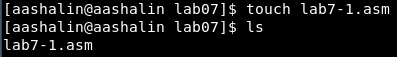{#fig:001 width=40%}

Скопировал программу из листинга 7.1 в lab7-1.asm (рис. [-@fig:002]).

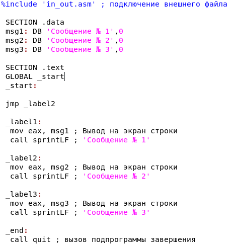{#fig:002 width=40%}

Создал и запустил исполняемый файл, убедился, что результат соответствует результату в задании (рис. [-@fig:003]).

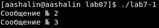{#fig:003 width=40%}

Скопировал программу из листинга 7.2 в lab7-1.asm (рис. [-@fig:004]).

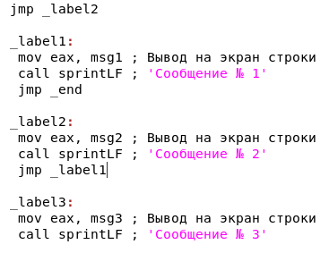{#fig:004 width=40%}

Создал исполняемый файл и проверил его работу (рис. [-@fig:005]).

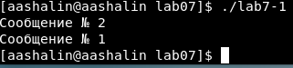{#fig:005 width=40%}

Модифицировал lab7-1.asm так, чтобы он выдал сообщение №3, затем №2, затем №1 (рис. [-@fig:006]).

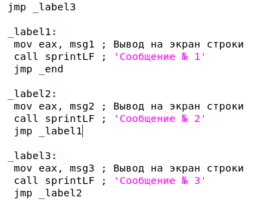{#fig:006 width=40%}

Создал исполняемый файл и проверил его работу (рис. [-@fig:007]).

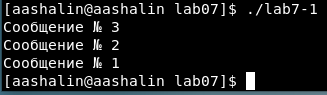{#fig:007 width=40%}

Скопировал программу из листинга 7.3 в lab7-2.asm (рис. [-@fig:008]).

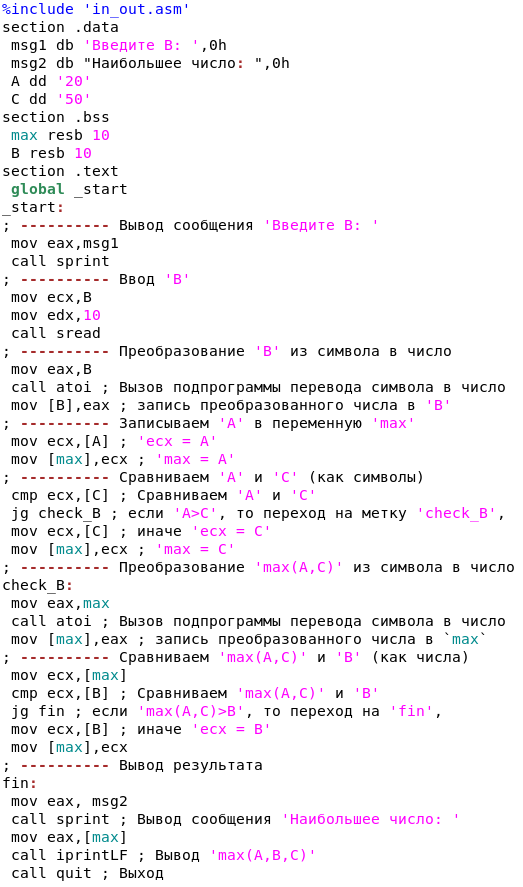{#fig:008 width=40%}

Создал листинг lab7-2.lst (рис. [-@fig:009]).

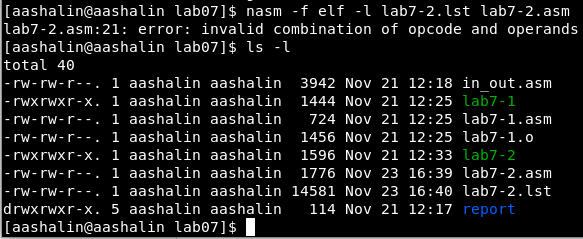{#fig:009 width=70%}

В этих трёх строках сначала eax перемещён в esi, затем 0 в eax, затем  0 в ecx.

``` lst
132 000000A0 89C6                <1>     mov     esi, eax
133 000000A2 B800000000          <1>     mov     eax, 0
134 000000A7 B900000000          <1>     mov     ecx, 0
```

Удалил один елемент (рис. [-@fig:010]).

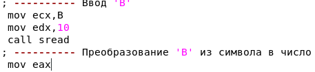{#fig:010 width=40%}

lab7-2.asm не создаётся, в листинг идёт ошибка (рис. [-@fig:011]).

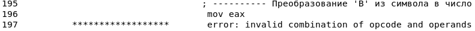{#fig:011 width=70%}

# Выполнение cамостоятельной работы

После написания программы для нахождения наименьшей из трёх переменных $a, b$ и $c$ в текстовом файле lab7-3.asm (вариант 12: 99,29,26, Листинг 1) создал исполняемый файл lab7-3 и проверил его работу (рис. [-@fig:012]).

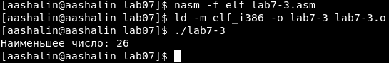{#fig:012 width=70%}

После написания программы для вычисления значения заданной функции $f(x)$ в текстовом файле lab7-4.asm (вариант 12: $ax, x<5$ или $x-5, x≥5$, Листинг 2) создал исполняемый файл lab7-4 и проверил его работу (рис. [-@fig:013]).

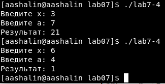{#fig:013 width=40%}

Листинг 1., lab7-3.asm

``` asm
%include 'in_out.asm'
section .data
 msg2 db "Наименьшее число: ",0h
 A dd '99'
 B dd '29'
 C dd '26'
section .bss
 min resb 10
; B resb 10
section .text
 global _start
_start:
; ---------- Вывод сообщения 'Введите B: '
; mov eax,msg1
; call sprint
; ---------- Ввод 'B'
; mov ecx,B
; mov edx,10
; call sread
; ---------- Преобразование 'B' из символа в число
 mov eax,B
 call atoi ; Вызов подпрограммы перевода символа в число
 mov [B],eax ; запись преобразованного числа в 'B'
; ---------- Записываем 'A' в переменную 'min'
 mov ecx,[A] ; 'ecx = A'
 mov [min],ecx ; 'min = A'
; ---------- Сравниваем 'A' и 'С' (как символы)
 cmp ecx,[C] ; Сравниваем 'A' и 'С'
 jl check_B ; если 'A<C', то переход на метку 'check_B',
 mov ecx,[C] ; иначе 'ecx = C'
 mov [min],ecx ; 'min = C'
; ---------- Преобразование 'min(A,C)' из символа в число
check_B:
 mov eax,min
 call atoi ; Вызов подпрограммы перевода символа в число
 mov [min],eax ; запись преобразованного числа в `min`
; ---------- Сравниваем 'min(A,C)' и 'B' (как числа)
 mov ecx,[min]
 cmp ecx,[B] ; Сравниваем 'min(A,C)' и 'B'
 jl fin ; если 'min(A,C)<B', то переход на 'fin',
 mov ecx,[B] ; иначе 'ecx = B'
 mov [min],ecx
; ---------- Вывод результата
fin:
 mov eax, msg2
 call sprint ; Вывод сообщения 'Наибольшее число: '
 mov eax,[min]
 call iprintLF ; Вывод 'min(A,B,C)'
 call quit ; Выход
```

Листинг 2., lab7-4.asm

``` asm
%include 'in_out.asm'
section .data
 msgx db 'Введите x: ',0h
 msga db 'Введите a: ',0h
 msgr db "Результат: ",0h
section .bss
 res resb 10
 X resb 10
 A resb 10
section .text
 global _start
_start:
; ---------- Вывод сообщения 'Введите x: '
 mov eax,msgx
 call sprint
; ---------- Ввод 'x'
 mov ecx,X
 mov edx,10
 call sread
; ---------- Преобразование 'x' из символа в число
 mov eax,X
 call atoi ; Вызов подпрограммы перевода символа в число
 mov [X],eax ; запись преобразованного числа в 'x'


; ---------- Вывод сообщения 'Введите a: '
 mov eax,msga
 call sprint
; ---------- Ввод 'a'
 mov ecx,A
 mov edx,10
 call sread
; ---------- Преобразование 'a' из символа в число
 mov eax,A
 call atoi ; Вызов подпрограммы перевода символа в число
 mov [A],eax ; запись преобразованного числа в 'a'


 mov ebx,[X]
 cmp ebx,5 ; Сравниваем 'x' и 5
 jge check_X ; если 'x≥5', то переход на метку 'check_X',

 mov eax,[X]
 mov ebx,[A]
 mul ebx
 mov [res],eax
 jmp fin

check_X:

 mov eax,[X]
 sub eax,5
 mov [res],eax

; ---------- Вывод результата
fin:
 mov eax, msgr
 call sprint ; Вывод сообщения 'Результат: '
 mov eax,[res]
 call iprintLF ; Вывод 'res'
 call quit ; Выход
```

Ссылка на отчёт лабораторной №7, сделанный в Markdown. <https://github.com/arsenyshalin/study_2024-2025_arh-pc/tree/master/labs/lab07/report>

# Выводы

* Изучены команды условного и безусловного переходов.
* Приобретены навыки написания программ с использованием переходов
* С назначением и структурой файла листинга ознакомлен.
* Создана программа для вычисления выражения из вариантов, полученных из номера студенческого билета в лабораторной №6.


# Список литературы{.unnumbered}

::: {#refs}
:::
