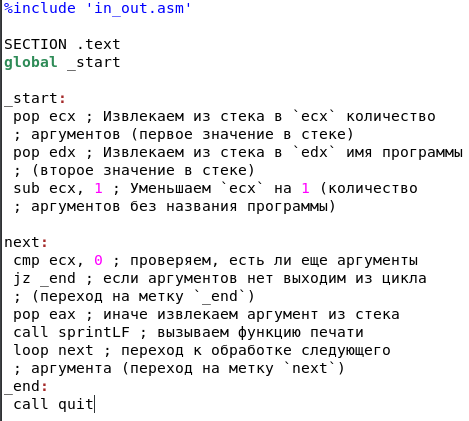

---
## Front matter
title: "Отчёт по лабораторной работе №8"
subtitle: "Дисциплина: Архитектура компьютера"
author: "Арсений Андреевич Шалин"

## Generic otions
lang: ru-RU
toc-title: "Содержание"

## Bibliography
bibliography: bib/cite.bib
csl: pandoc/csl/gost-r-7-0-5-2008-numeric.csl

## Pdf output format
toc: true # Table of contents
toc-depth: 2
lof: true # List of figures
lot: true # List of tables
fontsize: 12pt
linestretch: 1.5
papersize: a4
documentclass: scrreprt
## I18n polyglossia
polyglossia-lang:
  name: russian
  options:
	- spelling=modern
	- babelshorthands=true
polyglossia-otherlangs:
  name: english
## I18n babel
babel-lang: russian
babel-otherlangs: english
## Fonts
mainfont: IBM Plex Serif
romanfont: IBM Plex Serif
sansfont: IBM Plex Sans
monofont: IBM Plex Mono
mathfont: STIX Two Math
mainfontoptions: Ligatures=Common,Ligatures=TeX,Scale=0.94
romanfontoptions: Ligatures=Common,Ligatures=TeX,Scale=0.94
sansfontoptions: Ligatures=Common,Ligatures=TeX,Scale=MatchLowercase,Scale=0.94
monofontoptions: Scale=MatchLowercase,Scale=0.94,FakeStretch=0.9
mathfontoptions:
## Biblatex
biblatex: true
biblio-style: "gost-numeric"
biblatexoptions:
  - parentracker=true
  - backend=biber
  - hyperref=auto
  - language=auto
  - autolang=other*
  - citestyle=gost-numeric
## Pandoc-crossref LaTeX customization
figureTitle: "Рис."
tableTitle: "Таблица"
listingTitle: "Листинг"
lofTitle: "Список иллюстраций"
lotTitle: "Список таблиц"
lolTitle: "Листинги"
## Misc options
indent: true
header-includes:
  - \usepackage{indentfirst}
  - \usepackage{float} # keep figures where there are in the text
  - \floatplacement{figure}{H} # keep figures where there are in the text
---

# Цель работы

Приобретение навыков написания программ с использованием циклов и обработкой аргументов командной строки.

# Выполнение лабораторной работы

Создал файл lab8-1.asm в каталоге для программ лабораторной работы №8 (рис. [-@fig:001]).

{#fig:001 width=40%}

Скопировал программу из листинга 8.1 в lab8-1.asm и создал и запустил исполняемый файл (рис. [-@fig:002]).

{#fig:002 width=40%}

Добавил изменение значение регистра ecx в цикле (рис. [-@fig:003]).

{#fig:003 width=40%}

Создал исполняемый файл и проверил его работу (рис. [-@fig:004]).

{#fig:004 width=40%}

Добавил команды push и pop для сохранения значения счетчика цикла loop (рис. [-@fig:005]).

{#fig:005 width=40%}

Создал исполняемый файл и проверил его работу (рис. [-@fig:006]).

{#fig:006 width=40%}

Скопировал программу из листинга 8.2 в lab8-2.asm (рис. [-@fig:007]).

{#fig:007 width=40%}

Создал исполняемый файл и проверил его работу, указав аргументы (рис. [-@fig:008]).

{#fig:008 width=40%}

Скопировал программу из листинга 8.3 в lab8-3.asm и создал и запустил исполняемый файл, указав аргументы (рис. [-@fig:009]).

{#fig:009 width=70%}

Модифицировал программу из lab8-3.asm для вычисления произведения аргументов командной строки (рис. [-@fig:010]).

{#fig:010 width=70%}

Создал исполняемый файл и проверил его работу, указав аргументы (рис. [-@fig:011]).

{#fig:011 width=70%}

# Выполнение cамостоятельной работы

Модифицировал программу из lab8-3.asm в main.asm для вычисления варианта 12, полученного в лабораторной №6 (рис. [-@fig:012]).

{#fig:012 width=70%}

Создал исполняемый файл и проверил его работу, указав аргументы (рис. [-@fig:013]).

{#fig:013 width=70%}

Листинг 1., lab8-1.asm

``` asm
%include 'in_out.asm'

SECTION .data
 msg1 db 'Введите N: ',0h

SECTION .bss
 N: resb 10

SECTION .text
 global _start
_start:

; ----- Вывод сообщения 'Введите N: '
 mov eax,msg1
 call sprint

; ----- Ввод 'N'
 mov ecx, N
 mov edx, 10
 call sread

; ----- Преобразование 'N' из символа в число
 mov eax,N
 call atoi
 mov [N],eax

; ------ Организация цикла
 mov ecx,[N] ; Счетчик цикла, `ecx=N`
label:
 push ecx ; добавление значения ecx в стек
 sub ecx,1 ; `ecx=ecx-1`
 mov [N],ecx
 mov eax,[N]
 call iprintLF ; Вывод значения `N`
 pop ecx ; извлечение значения ecx из стека
 loop label ; `ecx=ecx-1` и если `ecx` не '0'
            ; переход на `label`
 call quit
```

Листинг 2., lab8-2.asm

``` asm
%include 'in_out.asm'

SECTION .text
global _start

_start:
 pop ecx ; Извлекаем из стека в `ecx` количество
 ; аргументов (первое значение в стеке)
 pop edx ; Извлекаем из стека в `edx` имя программы
 ; (второе значение в стеке)
 sub ecx, 1 ; Уменьшаем `ecx` на 1 (количество
 ; аргументов без названия программы)

next:
 cmp ecx, 0 ; проверяем, есть ли еще аргументы
 jz _end ; если аргументов нет выходим из цикла
 ; (переход на метку `_end`)
 pop eax ; иначе извлекаем аргумент из стека
 call sprintLF ; вызываем функцию печати
 loop next ; переход к обработке следующего
 ; аргумента (переход на метку `next`)
_end:
 call quit
```

Листинг 3., lab8-3.asm

``` asm
%include 'in_out.asm'

SECTION .data
msg db "Результат: ",0

SECTION .text
global _start

_start:
 pop ecx ; Извлекаем из стека в `ecx` количество
 ; аргументов (первое значение в стеке)
 pop edx ; Извлекаем из стека в `edx` имя программы
 ; (второе значение в стеке)
 sub ecx,1 ; Уменьшаем `ecx` на 1 (количество
 ; аргументов без названия программы)
 mov esi, 1 ; Используем `esi` для хранения
 ; промежуточных сумм

next:
 cmp ecx,0h ; проверяем, есть ли еще аргументы
 jz _end ; если аргументов нет выходим из цикла
 ; (переход на метку `_end`)
 pop eax ; иначе извлекаем следующий аргумент из стека
 call atoi ; преобразуем символ в число
 mul esi
 mov esi,eax
 loop next ; переход к обработке следующего аргумента

_end:
 mov eax, msg ; вывод сообщения "Результат: "
 call sprint
 mov eax, esi ; записываем сумму в регистр `eax`
 call iprintLF ; печать результата
 call quit ; завершение программы
```

Листинг 4., main.asm

``` asm
%include 'in_out.asm'

SECTION .data
msg db "Функция: f(x)=15x-9",0ah,"Результат: ",0

SECTION .text
global _start

_start:
 pop ecx ; Извлекаем из стека в `ecx` количество
 ; аргументов (первое значение в стеке)
 pop edx ; Извлекаем из стека в `edx` имя программы
 ; (второе значение в стеке)
 sub ecx,1 ; Уменьшаем `ecx` на 1 (количество
 ; аргументов без названия программы)
 mov esi, 0 ; Используем `esi` для хранения
 ; промежуточных сумм

next:
 cmp ecx,0h ; проверяем, есть ли еще аргументы
 jz _end ; если аргументов нет выходим из цикла
 ; (переход на метку `_end`)
 pop eax ; иначе извлекаем следующий аргумент из стека
 call atoi ; преобразуем символ в число
 mov ebx,15
 mul ebx
 sub eax,9
 add esi,eax	
 loop next ; переход к обработке следующего аргумента

_end:
 mov eax, msg ; вывод сообщения "Результат: "
 call sprint
 mov eax, esi ; записываем сумму в регистр `eax`
 call iprintLF ; печать результата
 call quit ; завершение программы
```

Ссылка на отчёт лабораторной №8, сделанный в Markdown. <https://github.com/arsenyshalin/study_2024-2025_arh-pc/tree/master/labs/lab08/report>

# Выводы

* Приобретены навыки написания программ с использованием циклов и обработкой аргументов командной строки.
* Создана программа для вычисления выражения из варианта, полученного из номера студенческого билета в лабораторной №6.


# Список литературы{.unnumbered}

::: {#refs}
:::
