---
## Front matter
title: "Отчёт по лабораторной работе №9"
subtitle: "Дисциплина: Архитектура компьютера"
author: "Арсений Андреевич Шалин"

## Generic otions
lang: ru-RU
toc-title: "Содержание"

## Bibliography
bibliography: bib/cite.bib
csl: pandoc/csl/gost-r-7-0-5-2008-numeric.csl

## Pdf output format
toc: true # Table of contents
toc-depth: 2
lof: true # List of figures
lot: true # List of tables
fontsize: 12pt
linestretch: 1.5
papersize: a4
documentclass: scrreprt
## I18n polyglossia
polyglossia-lang:
  name: russian
  options:
	- spelling=modern
	- babelshorthands=true
polyglossia-otherlangs:
  name: english
## I18n babel
babel-lang: russian
babel-otherlangs: english
## Fonts
mainfont: IBM Plex Serif
romanfont: IBM Plex Serif
sansfont: IBM Plex Sans
monofont: IBM Plex Mono
mathfont: STIX Two Math
mainfontoptions: Ligatures=Common,Ligatures=TeX,Scale=0.94
romanfontoptions: Ligatures=Common,Ligatures=TeX,Scale=0.94
sansfontoptions: Ligatures=Common,Ligatures=TeX,Scale=MatchLowercase,Scale=0.94
monofontoptions: Scale=MatchLowercase,Scale=0.94,FakeStretch=0.9
mathfontoptions:
## Biblatex
biblatex: true
biblio-style: "gost-numeric"
biblatexoptions:
  - parentracker=true
  - backend=biber
  - hyperref=auto
  - language=auto
  - autolang=other*
  - citestyle=gost-numeric
## Pandoc-crossref LaTeX customization
figureTitle: "Рис."
tableTitle: "Таблица"
listingTitle: "Листинг"
lofTitle: "Список иллюстраций"
lotTitle: "Список таблиц"
lolTitle: "Листинги"
## Misc options
indent: true
header-includes:
  - \usepackage{indentfirst}
  - \usepackage{float} # keep figures where there are in the text
  - \floatplacement{figure}{H} # keep figures where there are in the text
---

# Цель работы

Приобретение навыков написания программ с использованием подпрограмм. Знакомство с методами отладки при помощи GDB и его основными возможностями.

# Выполнение лабораторной работы

Ввёл в файл lab9-1.asm текст программы из листинга 9.1. Создал исполняемый файл и проверил его работу (рис. [-@fig:001]).

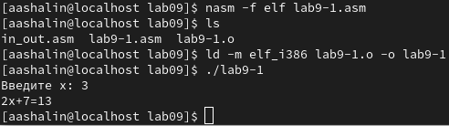{#fig:001 width=40%}

Модифицировал программу lab9-1.asm, добавив подпрограмму. (рис. [-@fig:002]).

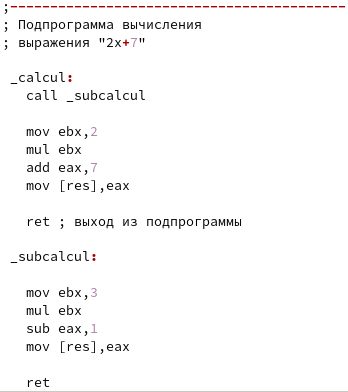{#fig:002 width=40%}

Создал исполняемый файл и проверил его работу (рис. [-@fig:003]).

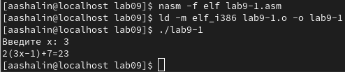{#fig:003 width=40%}

Создал файл lab9-2.asm с текстом программы из Листинга 9.2, получил исполняемый файл с отладочной информацией, загрузил его в отладчик gdb (рис. [-@fig:004]).

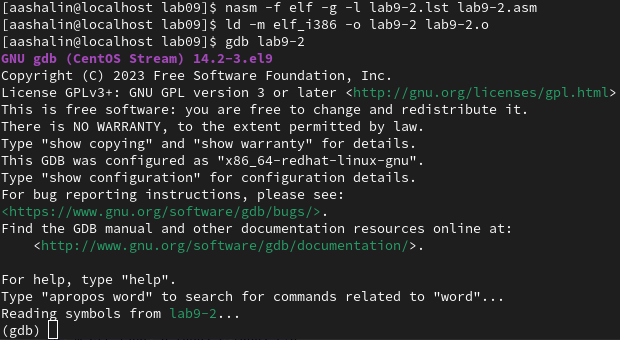{#fig:004 width=40%}

Проверил работу программы, запустив её в оболочке GDB с помощью команды run (рис. [-@fig:005]).

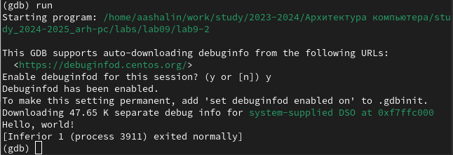{#fig:005 width=40%}

Установил брейкпоинт на метку _start, запустил программу (рис. [-@fig:006]).

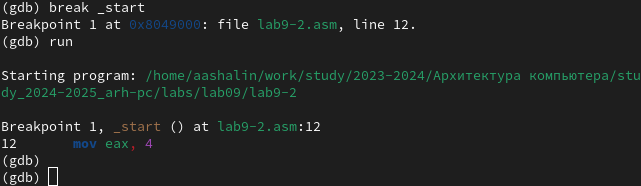{#fig:006 width=40%}

Посмотрел дисассимилированный код программы с помощью команды disassemble начиная с метки _start (рис. [-@fig:007]).

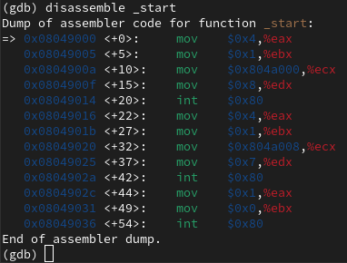{#fig:007 width=40%}

Переключился на отображение команд с синтаксисом Intel (рис. [-@fig:008]).
Отличается оно тем, что регистры менются местами с адресами, а также тем, что перед регистрами не написано %, перед адресами не написано $.

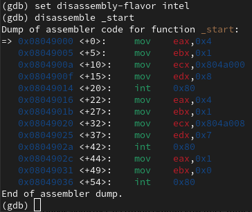{#fig:008 width=40%}

Включил режим псевдографики, проверил, что была установлена точка останова (рис. [-@fig:009]).

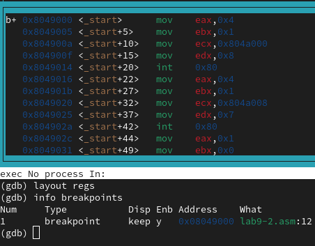{#fig:009 width=70%}

Определил адрес предпоследней инструкции (mov ebx,0x0) и установил точку останова, посмотрел информацию о всех установленных точках останова (рис. [-@fig:010]).
При пошаговом выполнении программы меняются значения eax, ebx, ecx, edx.

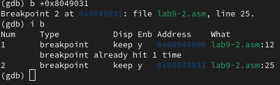{#fig:010 width=40%}

Посмотрел значение переменной msg1 и переменной msg2 по адресу (рис. [-@fig:011]).

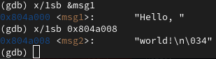{#fig:011 width=70%}

Изменил первый символ переменной msg1 (рис. [-@fig:012]).

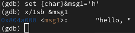{#fig:012 width=70%}

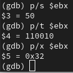{#fig:013 width=70%}

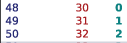{#fig:014 width=70%}

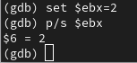{#fig:015 width=70%}

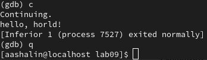{#fig:016 width=70%}

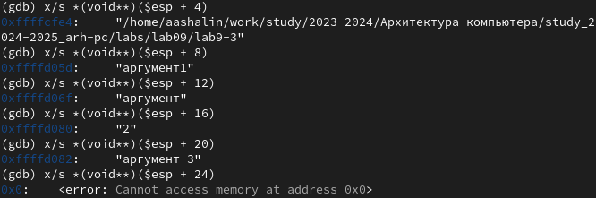{#fig:017 width=70%}

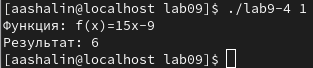{#fig:018 width=70%}

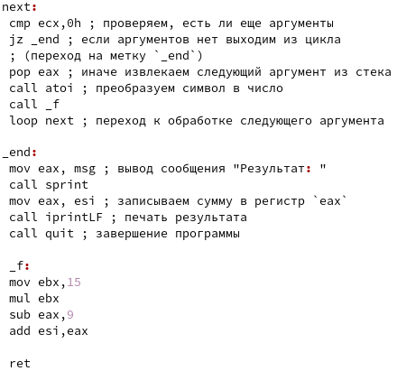{#fig:019 width=70%}

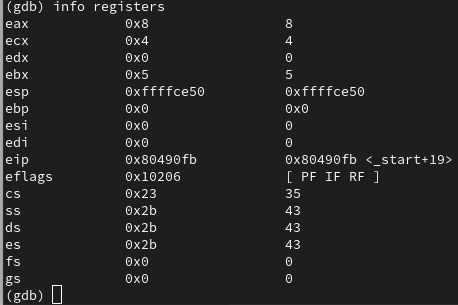{#fig:020 width=70%}

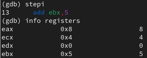{#fig:021 width=70%}

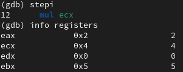{#fig:022 width=70%}

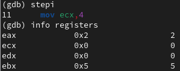{#fig:023 width=70%}

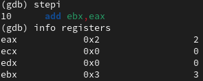{#fig:024 width=70%}

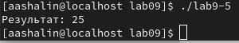{#fig:025 width=70%}

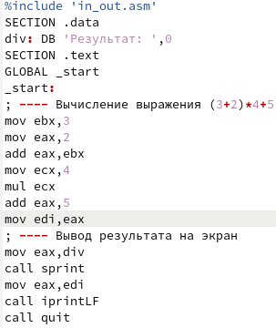{#fig:026 width=70%}

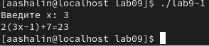{#fig:027 width=70%}

# Выполнение cамостоятельной работы

Выполнены все задания лабораторной работы, путём дебагинга в gdb найдены ошибки в исходной программе в строках 10, 14, 15. Скриншот (рис. [-@fig:026]). Ошибки исправлены (рис. [-@fig:027]).

# Выводы

* Навыки написания программ с использованием подпрограмм приобретены.
* С методами отладки при помощи GDB и его основными возможностям ознакомился.

# Список литературы{.unnumbered}

::: {#refs}
:::
