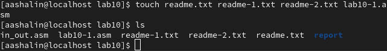
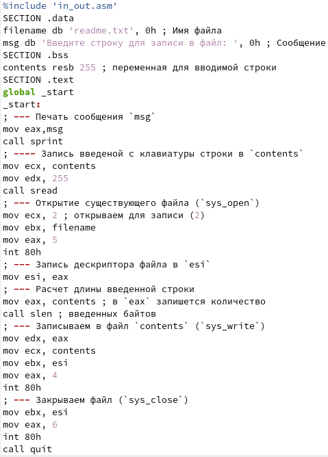
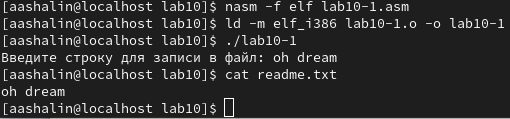
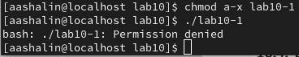
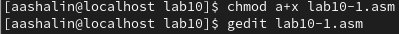
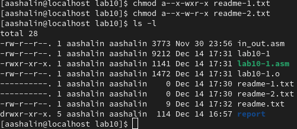
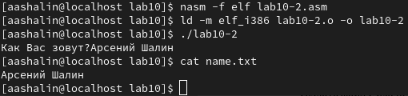

---
## Front matter
title: "Отчёт по лабораторной работе №10"
subtitle: "Дисциплина: Архитектура компьютера"
author: "Арсений Андреевич Шалин"

## Generic otions
lang: ru-RU
toc-title: "Содержание"

## Bibliography
bibliography: bib/cite.bib
csl: pandoc/csl/gost-r-7-0-5-2008-numeric.csl

## Pdf output format
toc: true # Table of contents
toc-depth: 2
lof: true # List of figures
lot: true # List of tables
fontsize: 12pt
linestretch: 1.5
papersize: a4
documentclass: scrreprt
## I18n polyglossia
polyglossia-lang:
  name: russian
  options:
	- spelling=modern
	- babelshorthands=true
polyglossia-otherlangs:
  name: english
## I18n babel
babel-lang: russian
babel-otherlangs: english
## Fonts
mainfont: IBM Plex Serif
romanfont: IBM Plex Serif
sansfont: IBM Plex Sans
monofont: IBM Plex Mono
mathfont: STIX Two Math
mainfontoptions: Ligatures=Common,Ligatures=TeX,Scale=0.94
romanfontoptions: Ligatures=Common,Ligatures=TeX,Scale=0.94
sansfontoptions: Ligatures=Common,Ligatures=TeX,Scale=MatchLowercase,Scale=0.94
monofontoptions: Scale=MatchLowercase,Scale=0.94,FakeStretch=0.9
mathfontoptions:
## Biblatex
biblatex: true
biblio-style: "gost-numeric"
biblatexoptions:
  - parentracker=true
  - backend=biber
  - hyperref=auto
  - language=auto
  - autolang=other*
  - citestyle=gost-numeric
## Pandoc-crossref LaTeX customization
figureTitle: "Рис."
tableTitle: "Таблица"
listingTitle: "Листинг"
lofTitle: "Список иллюстраций"
lotTitle: "Список таблиц"
lolTitle: "Листинги"
## Misc options
indent: true
header-includes:
  - \usepackage{indentfirst}
  - \usepackage{float} # keep figures where there are in the text
  - \floatplacement{figure}{H} # keep figures where there are in the text
---

# Цель работы

Приобретение навыков написания программ для работы с файлами.

# Выполнение лабораторной работы

Создал файлы lab10-1.asm, readme-1.txt и readme-2.txt (рис. [-@fig:001]).

{#fig:001 width=40%}

Ввёл в lab10-1.asm программу из листинга 10.1 (рис. [-@fig:002]).

{#fig:002 width=40%}

Создал исполняемый файл и проверил его работу (рис. [-@fig:003]).

{#fig:003 width=40%}

Запретил выполнение файла lab10-1. Как видно, исполнение теперь не происходит (рис. [-@fig:004]).

{#fig:004 width=40%}

Добавил права на исполнение файла lab10-1.asm. Исполнение происходит (рис. [-@fig:005]).

{#fig:005 width=40%}

Предоставил права в соответствии с вариантом 12 (рис. [-@fig:006]).

{#fig:006 width=40%}

# Выполнение cамостоятельной работы

Написал программу lab10-2.asm, проверил её работу (рис. [-@fig:007]).

{#fig:007 width=40%}

lab10-1.asm:
``` asm
%include 'in_out.asm'
SECTION .data
filename db 'readme.txt', 0h ; Имя файла
msg db 'Введите строку для записи в файл: ', 0h ; Сообщение
SECTION .bss
contents resb 255 ; переменная для вводимой строки
SECTION .text
global _start
_start:
; --- Печать сообщения `msg`
mov eax,msg
call sprint
; ---- Запись введеной с клавиатуры строки в `contents`
mov ecx, contents
mov edx, 255
call sread
; --- Открытие существующего файла (`sys_open`)
mov ecx, 2 ; открываем для записи (2)
mov ebx, filename
mov eax, 5
int 80h
; --- Запись дескриптора файла в `esi`
mov esi, eax
; --- Расчет длины введенной строки
mov eax, contents ; в `eax` запишется количество
call slen ; введенных байтов
; --- Записываем в файл `contents` (`sys_write`)
mov edx, eax
mov ecx, contents
mov ebx, esi
mov eax, 4
int 80h
; --- Закрываем файл (`sys_close`)
mov ebx, esi
mov eax, 6
int 80h
call quit
```

lab10-2.asm:

``` asm
%include 'in_out.asm'
SECTION .data
filename db 'name.txt', 0h ; Имя файла
msg db 'Как Вас зовут?', 0h ; Сообщение
SECTION .bss
contents resb 255 ; переменная для вводимой строки
SECTION .text
global _start
_start:
; --- Печать сообщения `msg`
mov eax,msg
call sprint
; ---- Запись введеной с клавиатуры строки в `contents`
mov ecx, contents
mov edx, 255
call sread
; --- Открытие существующего файла (`sys_open`)
mov ecx, 2 ; открываем для записи (2)
mov ebx, filename
mov eax, 5
int 80h
; --- Запись дескриптора файла в `esi`
mov esi, eax
; --- Расчет длины введенной строки
mov eax, contents ; в `eax` запишется количество
call slen ; введенных байтов
; --- Записываем в файл `contents` (`sys_write`)
mov edx, eax
mov ecx, contents
mov ebx, esi
mov eax, 4
int 80h
; --- Закрываем файл (`sys_close`)
mov ebx, esi
mov eax, 6
int 80h
call quit
```
# Выводы

Навыки написания программ для работы с файлами приобретены.

# Список литературы{.unnumbered}

::: {#refs}
:::
